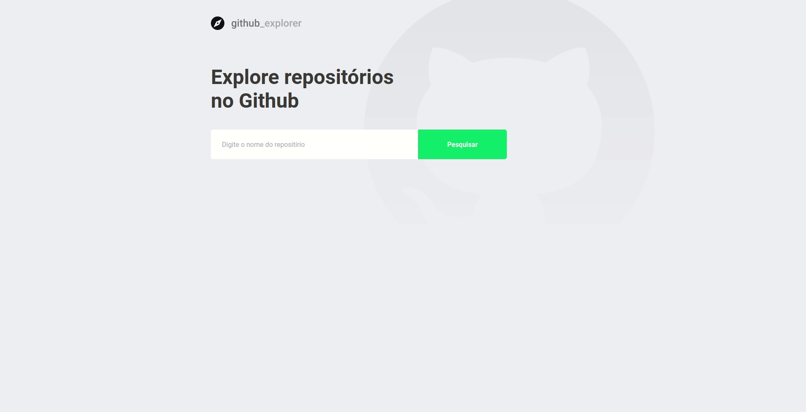

<h1> :telescope: Git Explorer :telescope:</h1>
<a href="https://www.figma.com/file/HOCmxfrElzLpI75LdzFLia/Github-Explorer?node-id=0%3A1">Link to Figma</a>

## :bulb: Idea

The idea is basically consume the Github api for create an simple explorer of usersand repositories

## :tv: Gifs

<b>Dashboard</b>

## :exclamation: How to run

- :floppy_disk: Download this repository and install all dependencies using <code>yarn or npm i</code>
- :computer: Start the build inside of root folder using <code>yarn start or npm run start</code>
- :metal: Finish enjoy the project !!

#### Made with :heart: for <a href="https://www.github.com/martins20">Martins20</a> and <a href=""https://github.com/Rocketseat>Rocketseat</a>
